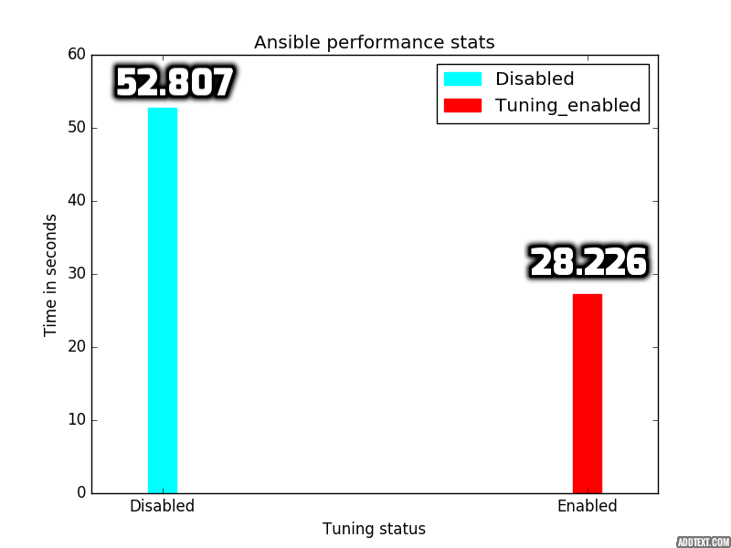

# ansible_perf_tuning
Tunes the performance of ansible by changing the number of forks, by enabling pipelining, profiling of tasks and by caching facts to a redis container

You can also choose to collect sosreports, facts by running collect/sosreport_facts.yml playbook and then visualize them using visualization/main.yml

### facts_cache.yml
Ansible first uses setup module to gather facts about all the hosts involved and deletes them after each run which consumes time, instead
this playbook will install docker, start redis container i.e enable caching of facts to a redis container running on the controller machine
on which you are running playbook which will boost the performance by caching the facts thus reducing the time taken to gather each time a
playbook is run.

### forks_pipelining.yml
This playbook will set the number of forks equal to number of hosts. 
If the number of forks are more than number of hosts, there will be a penalty for each task since there will be multiple processes running
and it will take some time to shut them down. On the other hand if the number of forks are less than the number of hosts, then each task will 
take a lot more time since hosts configured by ansible in parallel will be less in this case.

If you can use pipelining, Ansible will reduce the amount of files transferred over the wire, making everything much more efficient. 
Enabling pipelining reduces the number of SSH operations required to execute a module on the remote server. 
Running this playbook will automatically enable pipelining when you are running RHEL > 6, Centos, Fedora.

You can also choose to enable profiling of tasks. 

### collect/sosreport_facts.yml
Collects sosreport, ansible_facts from remotes on to the local machine and deletes them on remotes. This will help in finding out
performance bottlenecks.

You can choose to visulaize the ansible_facts. visualization/main.yml will configure http server to render a static html page showing the 
parsed ansible_facts. You can access it at http://localhost/view.html

### visualization/main.yml
This playbook will configure http server to render a static html page showing the parsed ansible_facts.
You can use playbooks/colect/sosreport_facts.yml to collect facts, generate sosreport.

### ara.yml
Installs, configures ara which makes ansible runs easier to visualize and troubleshoot. 
You can access the dashboard at http://localhost:8080

More info about ara is available on https://github.com/dmsimard/ara

### graphs
You can find sample graphs showing how the performance has improved by enabling the above features.
For example, the following graph shows the time taken to run the tasks before and after the tuning:


### Ansible recommend
This will recommend you of ways to boost the performance by looking at your ansible.cfg

## Requirements
You need to have these installed on your host
   - Ansible
   - python

### Installing roles
```
$ ansible-galaxy install name-of-the-role
```

### Run facts_cache.yml
```
$ ansible-playbook -i hosts --extra-vars  '{"CONFIG_PATH":"/PATH/TO/ANSIBLE.CONFIG"}' facts_cache.yml 
```

### Run forks_pipelining.yml playbook
```
$ ansible-playbook -i hosts --extra-vars '{"CONFIG_PATH":"/PATH/TO/ANSIBLE.CONFIG"}' forks_pipelining.yml
```

### Ansible recommend
```
$ python ansible_recommend.py /path/to/your/ansible.cfg
```
### Run visualizations/main.yml
```
$ ansible-playbook -i hosts --extra-vars '{"RESULTS_PATH": "/path/to/your/collected_facts"}'
```
### Run ara.yml
```
$ ansible-playbook -i hosts --extra-vars '{"CONFIG_PATH":"/PATH/TO/ANSIBLE.CONFIG"}' ara.yml
```

### Run sosreport_facts.yml
```
$ ansible-playbook -i hosts sosreport_facts.yml
```

#### variables

SOSREPORT_PATH - Directory to save results

HOSTS_PATH - Inventory file path

#### override
You can override the variables like
```
$ ansible-playbook --extra-vars '{"HOSTS_PATH":"/tmp/hosts"}' generate.yml
```
#### Example output

```

PLAY [test] ********************************************************************

TASK [setup] *******************************************************************
ok: [host.example.com]

TASK [Install sos via dnf] *****************************************************
ok: [host.example.com] => (item=[u'sos', u'rsync', u'ansible'])

TASK [Install sos via yum] *****************************************************
skipping: [host.example.com] => (item=[]) 

TASK [Install rsync on local] **************************************************
changed: [host -> localhost

TASK [results directory] *******************************************************
changed: [host.example.com -> localhost]

TASK [register timestamp] ***********************************************************************
changed: [host.example.com]

TASK [create directory to store reults] ********************************************************************
changed: [host.example.com -> localhost]

TASK [see that directory doesn't have any files] ***************************************************
changed: [host.example.com]

TASK [Run sosreport] ***********************************************************
changed: [host.example.com]]

TASK [Sync the results from remote] ********************************************
changed: [host.example.com]`

TASK [Delete the results on remotes] ******************************************************
changed: [host.example.com]

TASK [Create dir for ansible_facts] ********************************************
changed: [host.example.com -> localhost]

TASK [Collect ansible_facts] ***************************************************
changed: [host.example.com -> localhost]

PLAY RECAP *********************************************************************
host.example.com : ok=12   changed=10   unreachable=0    failed=0

```

### Enable profiling of tasks
```
$ ansible-playbook -i hosts --extra-vars '{"CONFIG_PATH":"/tmp/ansible.cfg", "SET_PROFILING":"yes" }' forks_pipelining.yml
```
### Testing
Ansible profile plugin can be used to findout the time taken by each task. You can enable it by adding this line to ansible.cfg
callback_whitelist = profile_tasks

You can set export ANSIBLE_DEBUG = 1 in your environment. This will generate verbose output, you will be able to see the timing 
of internal commands.

Profiling tasks will also help in identifying which steps are slow.

### Files

```
├── ansible_recommend
│   ├── ansible_recommend.py
│   └── README.md
├── graphs
│   ├── ansible_all_tuned
│   │   └── tuned.png
│   ├── ansible_cache
│   │   ├── ansible_cache.py
│   │   └── cacheVSno-cache.png
│   └── ansible_pipelining
│       ├── pipelining.png
│       └── pipelining.py
├── hosts
├── playbooks
│   ├── ara
│   │   ├── ara.yml
│   │   ├── containerized_ara.yml
│   │   └── README.md
│   ├── collect
│   │   ├── README.md
│   │   └── sosreport_facts.yml
│   ├── facts_cache
│   │   └── facts_cache.yml
│   └── forks_pipelining
│       └── forks_pipelining.yml
├── README.md
├── roles
│   ├── andrewrothstein.elasticsearch
│   │   ├── defaults
│   │   │   └── main.yml
│   │   ├── handlers
│   │   │   └── main.yml
│   │   ├── LICENSE
│   │   ├── meta
│   │   │   └── main.yml
│   │   ├── README.md
│   │   ├── requirements.yml
│   │   ├── tasks
│   │   │   └── main.yml
│   │   ├── test.yml
│   │   └── vars
│   │       ├── Debian.yml
│   │       ├── main.yml
│   │       └── RedHat.yml
│   └── dochang.docker
│       ├── CHANGELOG.md
│       ├── defaults
│       │   └── main.yml
│       ├── LICENSE
│       ├── meta
│       │   └── main.yml
│       ├── README.md
│       ├── tasks
│       │   ├── installer
│       │   │   ├── default.yml
│       │   │   └── pacman.yml
│       │   ├── install.yml
│       │   └── main.yml
│       ├── tests
│       │   ├── inventory
│       │   └── test.yml
│       └── vars
│           ├── installer
│           │   ├── Archlinux.yml
│           │   └── default.yml
│           └── main.yml
├── visualization
│   ├── main.yml
│   ├── README.md
│   └── templates
│       └── httpd.conf.j2
└── workload
    ├── playbooks
    │   └── workload
```
